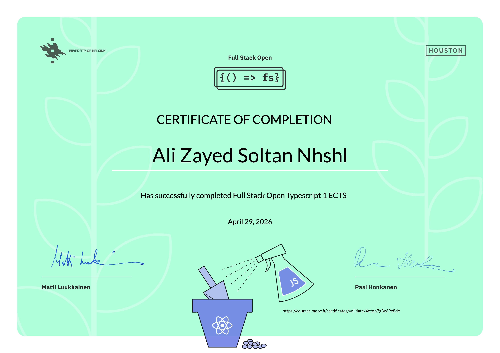

# Hi 👋, I'm Ali Nhshl

### Full Stack Developer | React, Next.js & Node.js Specialist
I am a passionate **IT Graduate** from Sana'a Community College specialized in building scalable, production-ready web applications. My expertise lies in the **modern JavaScript ecosystem**, with a deep focus on creating fast, responsive, and real-time user experiences.

---

### 📊 My GitHub Journey

  

  
  

---

### 🏆 Certifications & Achievements
*   **Full Stack Open (Parts 0-9) - University of Helsinki:** Completed the deep-dive into modern web development, covering React, Redux, Node.js, MongoDB, GraphQL, TypeScript, and CI/CD.
  
   

*   **Next.js Dashboard Specialization:** Built a full-stack financial dashboard focused on App Router logic, Server Actions, and Auth.js.

---

### 🛠️ Featured Web Projects

#### 📈 [Next.js Financial Dashboard](https://github.com)
*A professional financial management system.*
- **Tech:** Next.js 15, PostgreSQL, Auth.js, Tailwind CSS, Zod.
- **Key Features:** Server-side search & pagination, secure authentication, and real-time data fetching.
- **Live Demo:** [[https://vercel.app](https://vercel.app)](https://nextjs-dashboard-62umryl26-engnhshl-1867s-projects.vercel.app/login)

#### 📋 [Sync-Board](https://github.com/Eng-Nhshl/sync-board)
*Real-time collaborative Kanban board.*
- **Tech:** MERN Stack & Socket.io.
- **Key Features:** Live synchronization allowing multiple users to manage tasks simultaneously.

#### 🎙️ [Chat-App](https://github.com/Eng-Nhshl/real-time-chat)
*Instant messaging platform.*
- **Tech:** MongoDB, Express, React, Node.js, Socket.io.

---

### 🛠️ Technical Toolbox
**Frontend**

  
  
  
  
  

**Backend & Database**

  
  
  
  

---

### 📈 Current Focus
- **Advanced TypeScript:** Implementing strict type safety across full-stack architectures.
- **DevOps:** Scaling applications using Docker and automated deployment workflows.

---

### 📫 Let's Connect!

*“Building the web, one component at a time.”*

