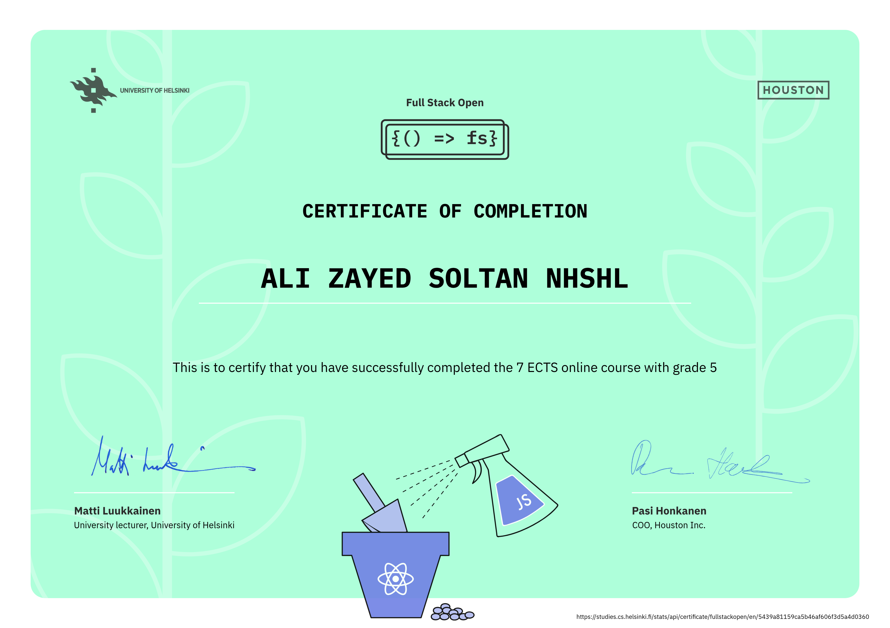
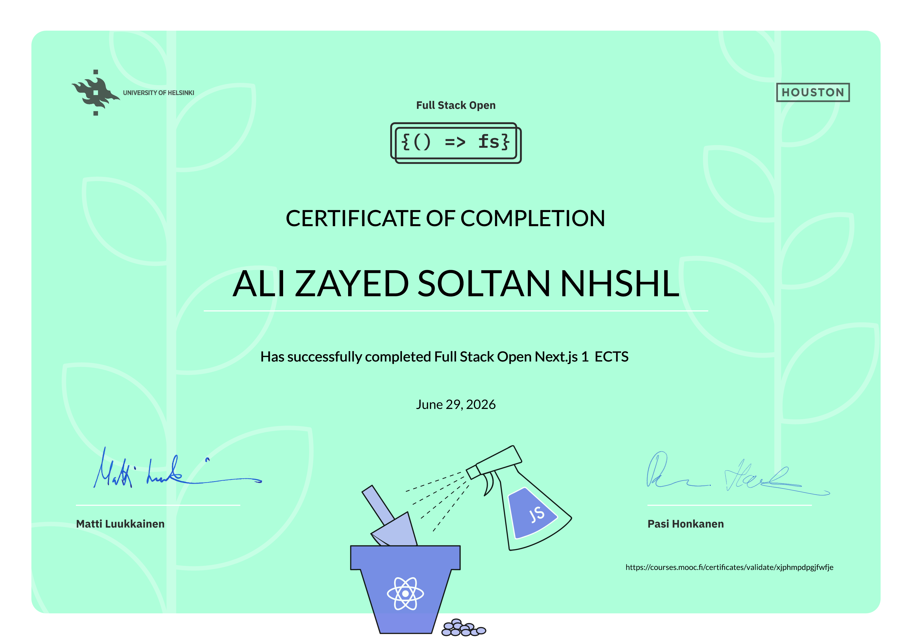

# Ali Nhshl

## Full-Stack Developer | React, Next.js & Node.js

Building modern, scalable, and user-focused web applications with clean architecture and polished user experiences.

---

### About Me

I am a passionate IT graduate from Sana'a Community College with a strong interest in building production-ready web applications. My work focuses on modern JavaScript technologies, especially React, Next.js, TypeScript, Node.js, and database-driven systems that are fast, reliable, and maintainable.

I enjoy turning ideas into polished digital products and continuously improving my craft through hands-on learning and real-world development.

---

### 🏆 Certifications & Achievements

- Full Stack Open (Parts 0–9) — University of Helsinki
- Completed an intensive curriculum covering React, Redux Toolkit, Node.js, Express, MongoDB, GraphQL, TypeScript, testing, and modern full-stack architecture.
- Earned multiple ECTS credits through the core course and advanced specialization modules.

#### 📜 Certified Courses

- Full Stack Open (Core Curriculum) — University of Helsinki
  - Earned 7 ECTS credits in the foundations of modern web development.
  - Covered React, Redux Toolkit, Node.js/Express, MongoDB administration, and automated testing.

- Full Stack Open (GraphQL Part) — University of Helsinki
  - Earned 1 ECTS credit in schemas, queries, mutations, Apollo Client, and WebSockets.

- Full Stack Open (TypeScript Part) — University of Helsinki
  - Earned 1 ECTS credit in typed full-stack development and strict application architecture.

- Full Stack Open (Next.js Part) — University of Helsinki
  - Earned 1 ECTS credit in building production-ready applications with Next.js.

---

### 🚀 Featured Projects

#### 🌐 Universal-Engine (Headless E-Commerce Monorepo)

A production-grade, headless e-commerce monorepo built for high performance and total content flexibility. By separating the frontend from the backend, it replaces rigid storefronts with a dynamic, modular component system driven entirely by a CMS schema. Perfectly suited for complex discovery flows, dynamic shop grids, and media-rich layouts.

*   **Tech Stack:** Next.js, TypeScript, React, Tailwind v4, Sanity CMS, pnpm Workspaces, Next Auth, Stripe
*   **Key Features:** Monorepo architecture, headless CMS integration, component-driven layouts, and lightning-fast staging/production environments.
*   **Links:** [Live Demo](https://e-commerce-universal-engine.vercel.app)

#### 🛍️ Robexe E-Commerce Platform

A full-stack e-commerce solution featuring a public storefront, a dedicated admin dashboard, and a robust REST API. Built as a monorepo to keep the frontend and backend closely coupled yet independently scalable.

*   **Tech Stack:** Turborepo, React, Express, PostgreSQL, Drizzle ORM, Better Auth
*   **Key Features:** End-to-end full-stack architecture, secure admin dashboard management, type-safe database queries via Drizzle, and production-ready cloud deployment.
*   **Links:** [Live Demo](https://robexe.vercel.app)

#### 📈 Next.js Financial Dashboard

A modern financial management application focused on data clarity, performance, and secure session handling. 

*   **Tech Stack:** Next.js 15, PostgreSQL, Auth.js, Tailwind CSS, Zod
*   **Key Features:** High-performance server-side search and pagination, schema validation via Zod, and efficient real-time data fetching using Next.js Server Components.
*   **Links:** [Live Demo](https://nextjs-dashboard-62umryl26-engnhshl-1867s-projects.vercel.app/login)

#### 📋 Sync-Board

A real-time collaborative Kanban board designed for smooth, instantaneous task coordination and team productivity.

*   **Tech Stack:** MongoDB, Express, React, Node.js (MERN), Socket.io
*   **Key Features:** Bi-directional real-time data synchronization, instant state updates across concurrent users, and drag-and-drop task management.
*   **Links:** [GitHub Repository](https://github.com/Eng-Nhshl/sync-board.git)

#### 💬 Chat-App

A lightweight instant messaging platform built from scratch to handle fast, reliable communication over persistent connections.

*   **Tech Stack:** MongoDB, Express, React, Node.js, Socket.io
*   **Key Features:** Real-time event-driven messaging, active session handling, and a highly responsive user interface.
*   **Links:** [GitHub Repository](https://github.com/Eng-Nhshl/real-time-chat.git)

---

### 🛠️ Technical Toolbox

<table width="100%" border="1" cellpadding="10" cellspacing="0" align="center" style="text-align:center;">
  <thead>
    <tr>
      <th width="20%" align="center" style="text-align:center;">Layer</th>
      <th width="30%" align="center" style="text-align:center;">Core Frameworks</th>
      <th width="50%" align="center" style="text-align:center;">Ecosystem & Tools</th>
    </tr>
  </thead>
  <tbody>
    <tr>
      <td align="center"><b>Frontend</b></td>
      <td align="center">
        
        
      </td>
      <td align="center">
        
        
      </td>
    </tr>
    <tr>
      <td align="center"><b>Backend</b></td>
      <td align="center">
        
      </td>
      <td align="center">
        
      </td>
    </tr>
    <tr>
      <td align="center"><b>Databases</b></td>
      <td align="center">
        
      </td>
      <td align="center">
        
      </td>
    </tr>
  </tbody>
</table>

---

### 📊 GitHub Insights

<table align="center" cellspacing="12" cellpadding="8">
  <tr>
    <td align="center" valign="top">
      
    </td>
    <td align="center" valign="top">
      
    </td>
  </tr>
</table>

---

### 🌱 Current Focus

- Advanced TypeScript and scalable full-stack architecture
- DevOps workflows, deployment automation, and cloud-ready applications
- Building interactive, real-time experiences with strong product thinking

---

### 📫 Let’s Connect

I’m always open to collaboration, freelance opportunities, and meaningful projects.

  
  
  

“Building thoughtful digital experiences, one component at a time.”
